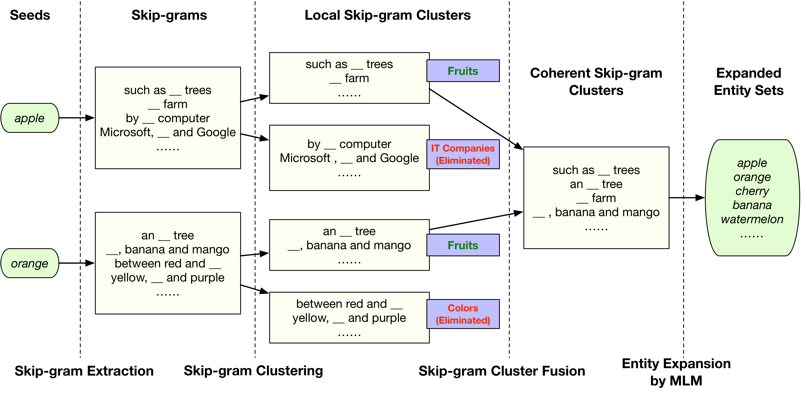

[](https://opensource.org/licenses/MIT)

# FUSE: Multi-Faceted Set Expansion by Coherent Clustering of Skip-grams

## Table of Contents
- [Introduction](#Introduction)
- [Requirements](#Requirements)
- [Data](#Data)
- [Code](#Code)
- [Citation](#Citation)


## Introduction
This project aims at __Multi-faceted Set Expansion__. Please find the paper [here](https://arxiv.org/pdf/1910.04345.pdf) (ECML-PKDD 2020). 

### What is set expansion? 
Set expansion aims to expand a small set of seed entities into a complete set of relevant entities. 
For example, to explore all Universities in the U.S., one can feed a seed set (_e.g._, {"Stanford", "UCB", "Harvard"}) to a set expansion system and then expect outputs such as "Princeton", "MIT", "UW" and "UIUC". 


### Why multi-faceted set expansion? 
In cases where the seed set is ambiguous (or some seeds are ambiguous), our algorithm FUSE is capable of returning multiple sets of entities, one for each semantic facet. 


### Model Overview 

<p align="center"></p>

Our model consists of three modules: 
1. __facet discovery__: it identifies all semantic facets of each seed entity by extracting and clustering its skip-grams;
2. __facet fusion__: it discovers shared semantic facets of the entire seed set by an optimization formulation; 
3. __entity expansion__: it expands each semantic facet by utilizing a masked language model (MLM) with pre-trained BERT models. 


## Requirements
The code is based on Python 3. Please install the dependencies as below:  
```
pip install -r requirements.txt
```


## Data
Please request the dataset from the authors of [EgoSet: Exploiting Word Ego-networks and User-generated Ontology for Multifaceted Set Expansion](https://dl.acm.org/doi/pdf/10.1145/2835776.2835808) (WSDM 2016) for reproducing our results.

We provide a sample dataset `data/dataset_sample.txt` for readers to play with the code. However, it does not represent any reliable results.

To run a sample code, please 1) download the pre-trained GloVe embedding and put it under `data/` and 2) download the pre-trained BERT model and put it under `data/` (You may want to fine-tune the BERT model depending on your own task).


## Code:
```
python ./Main.py -p 20
```
Argument: 

- `p` - preference in Affinity Propagation. We note that preference is sensitive to the dimensions of the word embeddings and the dataset. Please tune the preference parameter accordingly. 


## Citation
```bibtex
@inproceedings{zhu2020fuse,
    title = {FUSE: Multi-Faceted Set Expansion by Coherent Clustering of Skip-grams},
    author = {Zhu, Wanzheng and Gong, Hongyu and Shen, Jiaming and Zhang, Chao and Shang, Jingbo and Bhat, Suma and Han, Jiawei},
    booktitle = {The European Conference on Machine Learning and Principles and Practice of Knowledge Discovery in Databases (ECML-PKDD)},
    year = {2020}
}
```
